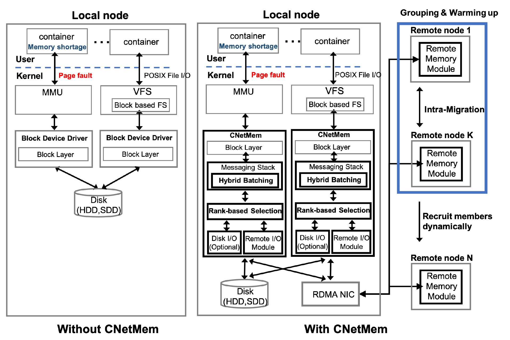

## Introduction


We present a transparent Container Network Memory storage device, coined as CNetMem, aiming to address the open problem of unpredictable performance degradation
of containers when the working set of an application no longer fits in container memory. First, CNetMem will enable application tenants running in a container to park their working set memory/file to a faster network memory storage by organizing a group of remote memory nodes as remote memory donors. This allows CNetMem to take advantage of remote idle memory on a cluster before resorting to a slow local I/O subsystem like local disk without any modification of host OS or application. Second, CNetMem provides a hybrid batching technique to remove or alleviate performance bottlenecks in the I/O performance critical path for remote memory read/write with replication or disk backup for fault tolerance. Third, CNetMem introduces a rank-based node selection algorithm to find the optimal node for placing remote memory blocks across cluster. This helps CNetMem to reduce the performance impact due to remote memory eviction. Extensive experiments are conducted on three big data applications and four machine learning workloads. The results show that CNetMem achieves up to 172x throughput improvements compared to vanilla Linux and up to 5.9x completion time improvements over existing approaches in big data and ML workload.

This repository contains the source code of the following paper:
Juhyun Bae, Ling Liu, KaHo Chow, Yanzhao Wu, Gong Su, Arun Iyengar "Transparent Network Memory Storage for Efficient
Container Execution in Big Data Clouds" In IEEE BigData, 2021.

This repository is for Mellanox ConnectX-3 driver with kernel 3.13 for fair comparison with previous approach in evaluation.

This repository will also be updated when RDMAbox Inbox Kernel 4.x version comes.



## Installation and Dependencies for Experiments in Paper (Kernel space Remote Paging System example)

1. Install MLNX_OFED driver
```bash
wget http://www.mellanox.com/downloads/ofed/MLNX_OFED-3.1-1.0.3/MLNX_OFED_LINUX-3.1-1.0.3-ubuntu14.04-x86_64.tgz .
tar -xvf MLNX_OFED_LINUX-3.1-1.0.3-ubuntu14.04-x86_64.tgz
cd ~/MLNX_OFED_LINUX-3.1-1.0.3-ubuntu14.04-x86_64
sudo ./mlnxofedinstall --add-kernel-support --without-fw-update --force
```

2. Install

(for both client and server node)
```bash
cd ~/CNetMem/setup
./install.sh
```

3. Run CNetMem Memory support module

Assume that IP address is 100.10.10.0(client)/100.10.10.1(remote memory donor1)/100.10.10.2(remote memory donor2)/100.10.10.3(remote memory donor3) and disk partion is /dev/sda3

(Modify portal list)

vi CNetMem/setup/portal.list
```bash
3 -> number of donor nodes
100.10.10.1:9999 -> donor list : IPaddr and Port
100.10.10.2:9999
100.10.10.3:9999
```

(Peer nodes: repeat this for donor2 and 3)
```bash
cd ~/CNetMem/setup/
~/ib_setup.sh 100.10.10.1
cd ~/CNetMem/rmem_donor
./daemon -a 100.10.10.1 -p 9999 -i "/users/username/CNetMem/setup/portal.list"
```

(Client node)
```bash
cd ~/CNetMem/setup/
~/ib_setup.sh 100.10.10.0
sudo swapoff /dev/sda3
sudo ~/cnetmem_setup.sh 0
```

(Check)

sudo swapon -s (on client node)

## Setting parameters

CNetMem/cnetmem_module/rdmabox.h

- SERVER_SELECT_NUM [number]

  This number should be equal to or less than the number of peer nodes.(e.g. if 3 peers, this should be <=3)

- NUM_REPLICA [number]

  Number of replicated copies on peer nodes.
```bash
#define SERVER_SELECT_NUM 2
#define NUM_REPLICA 1
```

CNetMem/cnetmem_module/rpg_drv.h

- SWAPSPACE_SIZE_G [number]

  Set total size of swapspace for remote paging system

- BACKUP_DISK [string]

  Set disk partition path is diskbackup is used. (By default, remote paging system does not use diskbackup. Use replication)

```bash
#define SWAPSPACE_SIZE_G        40
#define BACKUP_DISK     "/dev/sda4"
```

## Supported Platforms for paging system example

Tested environment:

OS : Ubuntu 14.04(kernel 3.13.0)

RDMA NIC driver: MLNX_OFED 3.1

Hardware : Infiniband, Mellanox ConnectX-3/4, disk partition(Only if diskbackup option is enabled.)


## Status
The code is provided as is, without warranty or support. If you use our code, please cite:
```
@inproceedings{bae2021cnetmem,
  title={Transparent Network Memory Storage for Efficient Container Execution in Big Data Clouds},
  author={Bae, Juhyun and Liu, Ling and Chow, KaHo and Wu, Yanzhao and Su, Gong and Iyengar, Arun},
  booktitle={IEEE International Conference on BigData},
  year={2021},
  organization={IEEE}
}
```
